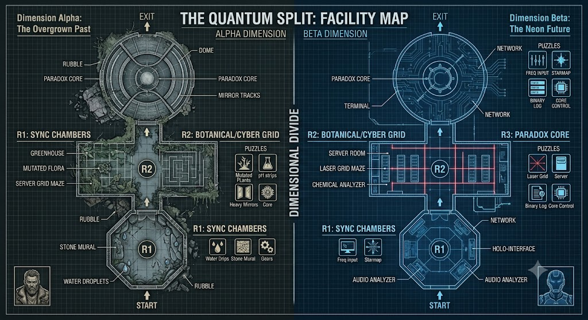
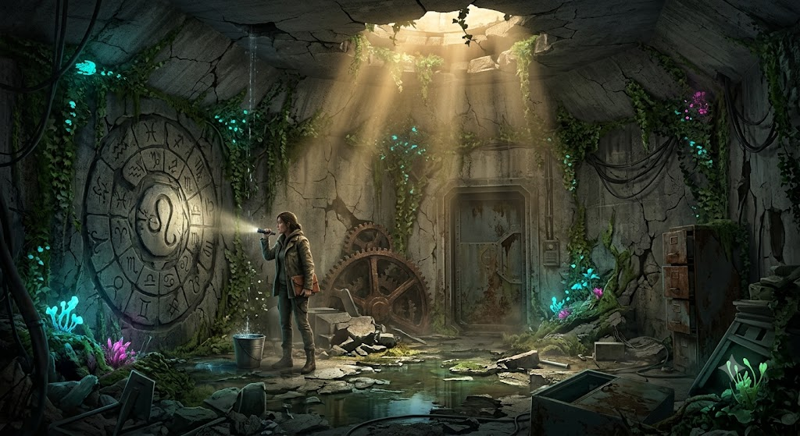
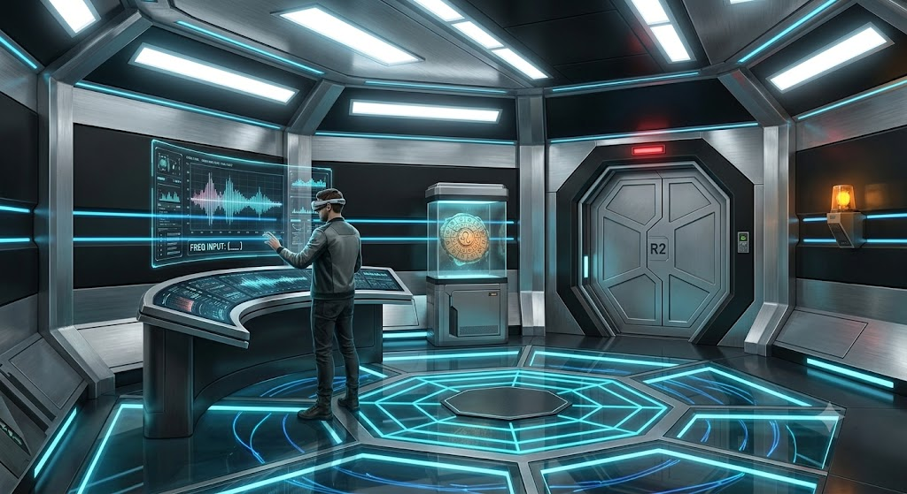
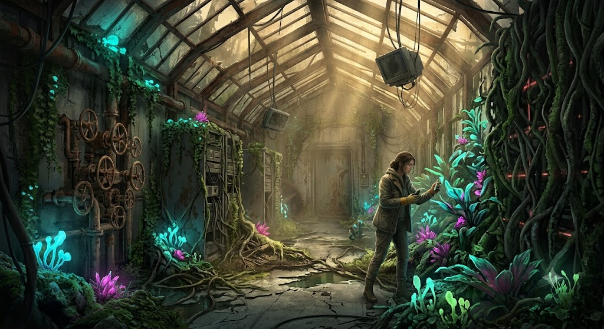
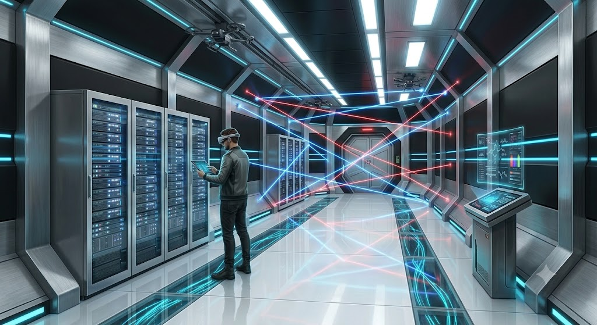
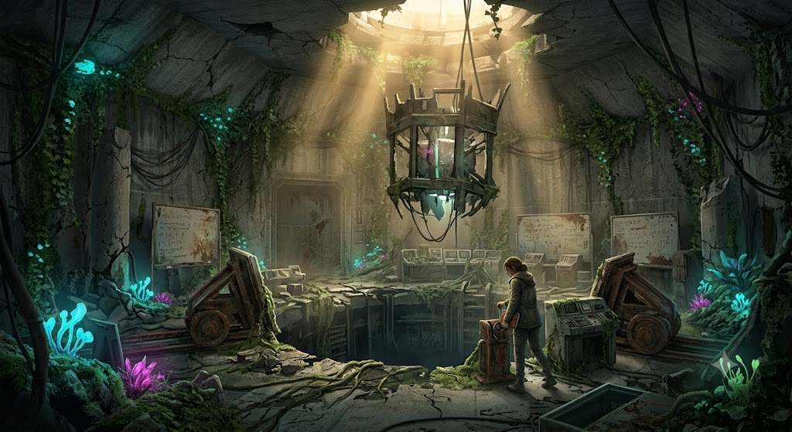
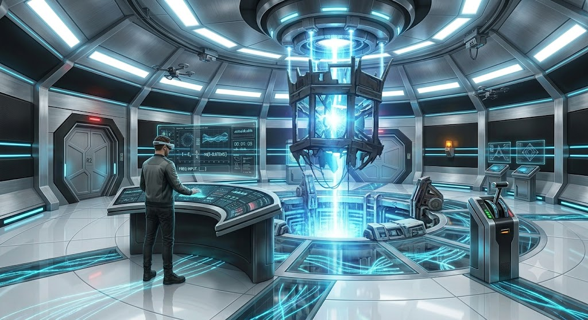

# The Quantum Split: Paradox Lab — Game Design Document

> **Status:** Concept finalized, art reference locked
> **Medium:** Real-time 3D (Three.js), browser-based
> **Players:** 2 (asymmetric co-op); scalable to teams
> **Reference art:** [`docs/reference/`](./reference/)

---

## 1. Premise

A temporal experiment splits one laboratory into **two parallel dimensions**.
Two players are separated — one per dimension — and must communicate constantly
over **voice chat**. The physical layout is identical, but the *clues* and
*environments* are completely different and **interdependent**: an action in one
dimension resolves a barrier in the other.

- **Dimension Alpha — The Overgrown Past:** brutalist bunker reclaimed by nature.
  Dark, damp, decaying, lit by golden sun shafts and bioluminescent moss.
- **Dimension Beta — The Neon Future:** the same lab as a sterile cyberpunk
  facility, pristine and hostile, run by an aggressive AI.

## 2. The Core Mechanic — The Mirrored Footprint

> **Both dimensions share the exact same physical blueprint.**

Structure (walls, doors, room shapes) is identical; contents are not. This is
how players guide each other:

> Player Beta: "There's a terminal on the left wall."
> Player Alpha: "I see a massive pile of rubble there."

**Implementation:** the footprint is authored once as data in
[`src/config/facility.ts`](../src/config/facility.ts). Each dimension renders
from those exact coordinates but supplies its own materials. Every prop slot has
a shared `kind` (archetype) so the same shape appears in the same spot in both
worlds. See [ARCHITECTURE.md](./ARCHITECTURE.md).

## 3. Facility Blueprint (Birds-Eye)



Sequential layout, running from `START` to `EXIT`:

| Order | Space | Shape | Alpha | Beta |
|------|-------|-------|-------|------|
| R1 | **Sync Chambers** | Small octagonal airlock | Overgrown ruin, stone mural | Sterile pod, holo audio analyzer |
| R2 | **Botanical / Cyber Grid** | Long rectangular corridor | Greenhouse of mutated flora | Server room + laser-grid maze |
| R3 | **Paradox Core** | Massive dome + central reactor pit | Overgrown reactor ruin | Pristine active reactor |

---

## 4. Room 1 — The Sync Chambers

Establishes the core communication loop. Goal: calibrate the dimensional link
and clear the initial lockdown.

| Alpha — Overgrown Past | Beta — Neon Future |
|---|---|
|  |  |

**Cast:** Alpha — a rugged female explorer with a flashlight. Beta — a
high-tech operative in an AR headset.

**Puzzle `sync.frequency` — Water Rhythm → Frequency:**
Alpha hears water dripping rhythmically into a bucket and taps out the rhythm.
Beta inputs that rhythm as a frequency wave into the **Holographic Audio
Analyzer**, unlocking a data file containing a **Star Map**.

**Puzzle `sync.starmap` — Star Map → Mural:**
Beta reads the Star Map coordinates back to Alpha. Alpha uses them to align the
astrological symbols on the **Stone Mural** (left wall), unlocking the hatch to
R2. (Alpha's rusted **gears** physically rotate the mural rings.)

## 5. Room 2 — The Botanical / Cyber Grid

The long testing corridor. Introduces complex cross-dimensional manipulation.

| Alpha — Greenhouse | Beta — Laser Grid |
|---|---|
|  |  |

**Puzzle `grid.chemical` — Soil/pH Analysis:**
Alpha runs **soil/pH test strips** on samples; the resulting colours give a
chemical base code (e.g. H₂SO₄) that Beta needs for the **Chemical Analyzer**.

**Puzzle `grid.bloom` — Laser Colour ↔ Flora Bloom (the intersection):**
Beta is trapped behind a deadly **Laser Grid Maze** (crimson + electric-blue).
Alpha's **mutated flora wall** changes colour in response to the laser colours
Beta emits. As Beta shifts colours, Alpha's plants **bloom in real time**,
revealing shapes that map the safe path. Alpha then guides Beta **through** the
deactivated laser path.

**Puzzle `grid.server` — Hack:**
Once across, Beta reaches the **server rack** (left wall) to perform a hack;
Alpha's rusted valves are the mirrored mechanism on the same wall.

## 6. Room 3 — The Paradox Core

The climax, in the massive dome around the central reactor pit. **Time dilation
is active** — the countdown runs faster for Beta, maximizing tension.

| Alpha — Overgrown Dome | Beta — Pristine Reactor |
|---|---|
|  |  |

**Puzzle `core.anchor` — Anchor Code:**
Alpha reads faded **whiteboard equations**; Beta reads matching **digital
time-dilation charts** at the **Core Control Terminal**. Together they derive the
"Anchor Code" constant that aligns both dimensions to the same physical moment.

**Puzzle `core.mirrors` — Mirror Alignment:**
Beta, reading the charts, tells Alpha exactly which overgrown **Heavy Mirrors**
on rusty tracks to align. Correct alignment channels energy across the pit.

**Puzzle `core.lever` — Simultaneous Escape:**
Both players reach the **Manual Lever** by the pit — rusted in Alpha, sleek
black in Beta. They must count down and **pull simultaneously** across the
temporal divide ("3, 2, 1, pull!") to merge the timelines and escape.

## 7. Puzzle Dependency Graph

```
sync.frequency ─► sync.starmap ─► [R2 unlocked]
                                      │
        grid.chemical ─┐             ▼
                        ├─► grid.bloom ─► grid.server ─► [R3 unlocked]
   (laser colours) ─────┘                                   │
                                                            ▼
                       core.anchor ─► core.mirrors ─► core.lever ─► ESCAPE
```

Every step is **cross-dimensional**: neither player can advance alone.

## 8. Audio & Atmosphere

| | **Alpha** | **Beta** |
|---|-----------|----------|
| Bed | Rhythmic water dripping | Low heavy-bass server hum |
| Movement | Roots shifting, concrete groaning | Synthetic A/C, recycled air |
| Accent | Unseen insects clicking | Digital chirps, terminals authenticating |

The `sync.frequency` puzzle makes Alpha's dripping *literally* a game mechanic.

## 9. Design Pillars

1. **Blind co-operation** — the fun is describing your world to someone who sees
   something totally different. Never break the mirrored footprint.
2. **Cross-dimension causality** — one player's action changes the *other's*
   world (laser colour → flora bloom is the flagship example).
3. **Contrast sells the split** — opposites in light, sound, texture, pace.
4. **Escalate to the merge** — the finale collapses both timelines into one act.

## 10. Open Questions / To Decide

- Locomotion: free first-person walk vs. node-based teleport.
- Exact frequency/mural/chemical code content and difficulty tuning.
- Time-dilation ratio in R3 (how much faster is Beta's clock?).
- Failure states: does a wrong laser path or missed lever pull reset a puzzle?
- Accessibility fallback for the voice-comms requirement (text / ping system).
- Scaling past 2 players: more dimensions, or multiple players per dimension.
